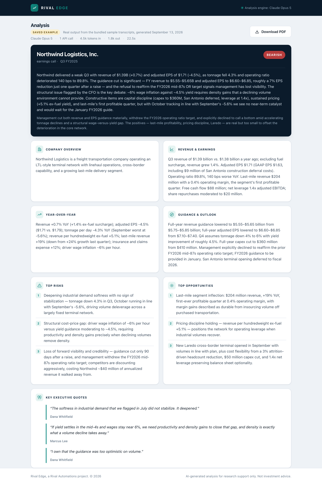

# Rival Edge

**An AI financial document analyzer that turns earnings call transcripts and 10-K filings into structured equity research summaries.**

Paste a transcript or upload a filing, and Rival Edge returns a labelled research note — revenue and earnings performance, year-over-year growth, management guidance, ranked risks and opportunities, verbatim executive quotes, and a sentiment call with reasoning. It also compares two reporting periods side by side and exports either view as a formatted PDF.

Built with Flask and the Claude API.

<!-- Drop a screenshot at docs/screenshot-analysis.png and uncomment the line below.

-->

---

## Why it exists

Reading a quarterly earnings call means working through 8,000–15,000 words to find the handful of facts that actually move a thesis: what revenue did, what guidance changed, what management is suddenly cautious about. A 10-K is an order of magnitude worse.

Rival Edge does that first pass. It does not pick stocks and it does not replace reading the filing — it produces the structured extract an analyst would otherwise spend an hour assembling by hand, so the human time goes to judgment instead of retrieval.

---

## Features

**Document input** — paste text directly, or upload a `.txt` or `.pdf` (drag and drop supported). PDFs are parsed server-side with PyPDF2.

**Structured analysis** — every run returns the same eleven fields, each rendered as its own card:

| Field | What it contains |
| --- | --- |
| Company overview | 1–2 sentences on the business |
| Revenue & earnings | Actual reported figures, with comparisons |
| Year-over-year | Growth or decline, decomposed where the document allows |
| Guidance & outlook | Forward guidance, raised/cut/maintained |
| Top risks | Three, ranked by materiality |
| Top opportunities | Three, ranked |
| Key quotes | Three verbatim, attributed to the speaker |
| Sentiment | Bullish / Neutral / Bearish, with reasoning |
| Analyst summary | A 3–4 sentence note in analyst voice |

**Quarter comparison** — submit two transcripts and get a delta table (metric, earlier, later, direction, commentary), guidance changes, shifts in management's tone, new versus resolved risks, and three things to watch next quarter.

**PDF export** — both views export as a typeset PDF with a navy masthead, alternating table rows, and directional colour coding. Built with fpdf2, no headless browser required.

**Long-document handling** — filings past ~320,000 characters are split on paragraph boundaries, condensed section by section into analyst notes, then analyzed in a final pass. Content is never truncated.

---

## How it works

```
Browser  ──▶  Flask (app.py)  ──▶  analyzer.py  ──▶  Claude API
                    │                     │
                    │                     ├─ short doc  ─▶ one structured call
                    │                     └─ long doc   ─▶ condense each section, then analyze
                    │
                    └──▶  fpdf2  ──▶  PDF download
```

Three engineering decisions worth calling out:

**Schema enforcement instead of JSON parsing.** The analysis and comparison shapes are declared as JSON Schema and passed to the API through `output_config.format`. The model cannot return prose, markdown fences, or a missing field — the response is valid JSON matching the schema or the request fails. That removes the entire class of "strip the code fence and hope `json.loads` works" bugs, and it lets the frontend render without defensive checks on every field.

**Map/reduce rather than truncation.** Claude Opus 5 has a 1M-token context window, so most filings fit in one call. The chunking path exists for the ones that don't, and for keeping latency and cost reasonable on very long documents. Sections are condensed by a cheaper "research associate" prompt that preserves figures and quotes but strips boilerplate, then the analysis prompt runs over the notes. Nothing is silently dropped, and the UI discloses when a document was condensed.

**Streaming for every request.** A 10-K analysis can legitimately run for minutes. Streaming with `get_final_message()` keeps the connection alive rather than risking an HTTP timeout, without complicating the calling code.

The app also enables server-side refusal fallbacks, so a request declined by a safety classifier is transparently re-run on a fallback model inside the same call instead of returning nothing.

---

## Running it locally

Requires Python 3.9 or newer and an [Anthropic API key](https://console.anthropic.com/settings/keys).

```bash
git clone https://github.com/<your-username>/rival-edge.git
cd rival-edge

python3 -m venv .venv && source .venv/bin/activate
pip install -r requirements.txt

cp .env.example .env        # then add your ANTHROPIC_API_KEY

python app.py
```

Open http://127.0.0.1:5001.

The default port is 5001 rather than Flask's usual 5000, which the macOS AirPlay Receiver occupies. Override it with `PORT=5002 python app.py` if 5001 is also taken.

### Configuration

| Variable | Required | Purpose |
| --- | --- | --- |
| `ANTHROPIC_API_KEY` | yes | Anthropic API credentials |
| `RIVAL_EDGE_FALLBACKS` | no | Set to `0` to disable server-side refusal fallbacks |
| `PORT` | no | Port to serve on (default `5001`) |

---

## Tech

| Layer | Choice | Why |
| --- | --- | --- |
| Backend | Flask 3 | Four routes and no persistence — a heavier framework would be overhead |
| AI | Claude Opus 5 via the Anthropic Python SDK | Long-context reasoning over financial prose; schema-enforced structured output |
| PDF input | PyPDF2 | Text extraction from uploaded filings |
| PDF output | fpdf2 | Typeset reports without a headless browser dependency |
| Frontend | Vanilla HTML/CSS/JS | No build step; the whole UI is one template and one stylesheet |
| Config | python-dotenv | Keys stay out of the repo |

No database. Documents are analyzed in memory and discarded when the request ends — nothing is written to disk.

---

## Project structure

```
rival-edge/
├── app.py             Flask routes and PDF report generation
├── analyzer.py        Claude integration, schemas, prompts, chunking
├── templates/
│   └── index.html     Single-page UI
├── static/
│   └── style.css      Stylesheet
├── requirements.txt
├── .env.example
└── README.md
```

---

## Limitations

- **Scanned PDFs are not supported.** Image-only PDFs contain no extractable text; the app detects this and asks for pasted text rather than returning an empty analysis. OCR would be the obvious next addition.
- **Analysis quality depends on the document.** Given a partial transcript, the model reports what is there and marks the rest "Not disclosed" — it does not infer missing figures. That is deliberate; a plausible invented number is worse than an admitted gap.
- **Comparison assumes the same company.** Two documents from different issuers will produce a comparison, but not a meaningful one.
- **Not investment advice.** Output is an AI-generated research aid. Verify every figure against the source filing before acting on it.

---

## License

MIT

---

Built by Luke McCormack · [Rival Automations](https://rivalautomations.com)
