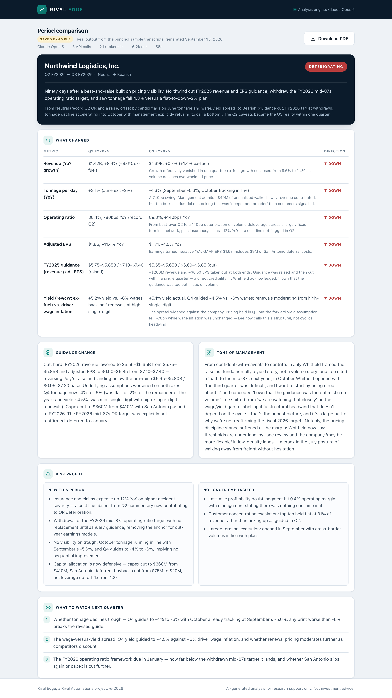
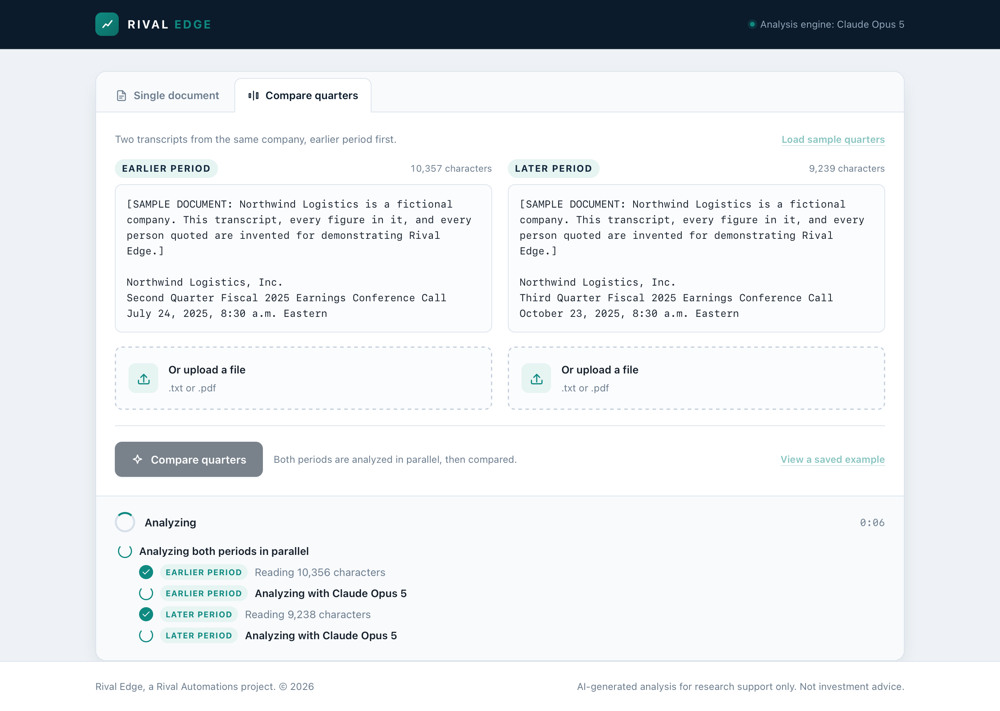
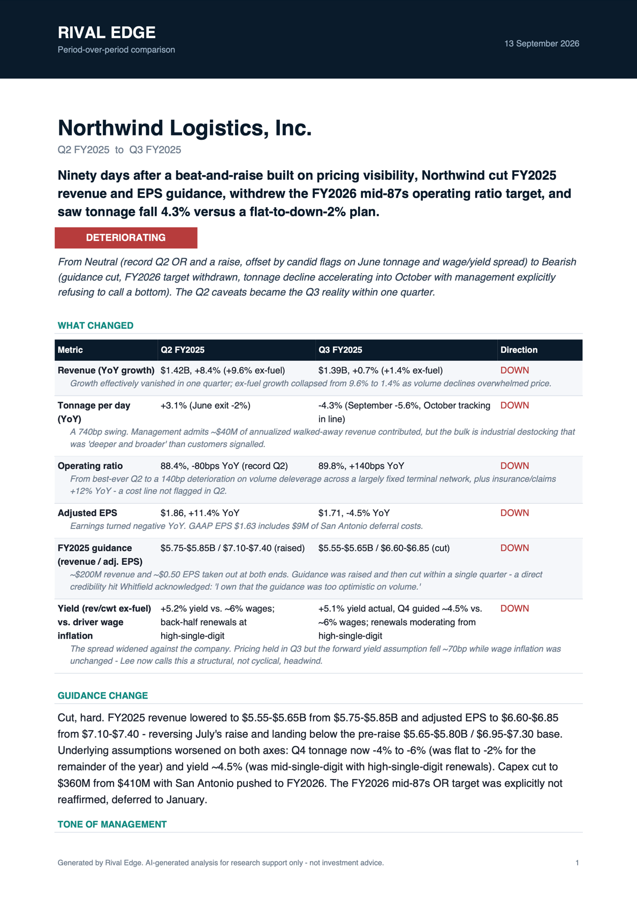
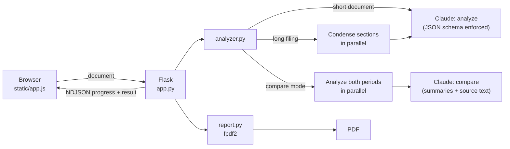

# Rival Edge

[](https://github.com/llmccormack/rival-edge/actions/workflows/ci.yml)


**An AI financial document analyzer that turns earnings call transcripts and 10-K filings into structured equity research notes.**

Paste a transcript or upload a filing. Rival Edge extracts revenue and earnings, year-over-year growth, guidance, ranked risks and opportunities, verbatim executive quotes, and a sentiment call with reasoning. It can compare two quarters to show what actually changed, and it exports either view as a typeset PDF.


<sub>Real output from Claude Opus 5 on the bundled sample transcript. Northwind Logistics is a fictional company.</sub>

---

## Try it in a minute

```bash
git clone https://github.com/llmccormack/rival-edge.git
cd rival-edge
python3 -m venv .venv && source .venv/bin/activate
pip install -r requirements.txt
cp .env.example .env          # add your ANTHROPIC_API_KEY
python app.py
```

Open **http://127.0.0.1:5001**, click **Load sample transcript**, then **Analyze document**.

No API key? The app still runs. It shows saved output from a real run, so you can explore every view and export a PDF without spending anything.

---

## What it does

### Structured analysis

Every run returns the same fields, each rendered as its own card: company overview, revenue and earnings with actual figures, year-over-year growth, guidance and outlook, three ranked risks, three ranked opportunities, three verbatim quotes with speakers, a Bullish / Neutral / Bearish call with reasoning, and a 3–4 sentence analyst summary.

The model is told to use only figures that appear in the document and to write "Not disclosed" instead of guessing. On the sample transcripts, every quote in the saved output appears verbatim in the source.

### Quarter-over-quarter comparison

Give it two transcripts from the same company and it produces a delta table (metric, earlier, later, direction, commentary), the guidance change, how management's tone shifted, which risks are new and which faded, and what to watch next quarter.



### Live progress

Analysis takes from 20 seconds to a few minutes. The UI shows each stage as it actually starts on the server, not a timer cycling canned messages. In compare mode, you can watch both periods being analyzed at once.



### PDF export

Both views export as an A4 report with a delta table, directional colour coding, and page breaks that respect table rows. See [`docs/example-comparison.pdf`](docs/example-comparison.pdf).



---

## How it works



| Mode | Claude calls | Typical time | Tokens (in / out) | Approx. cost |
| --- | --- | --- | --- | --- |
| Single earnings call | 1 | ~25 s | 4.5k / 1.8k | $0.07 |
| Two-quarter comparison | 3 | ~55 s | 21k / 6.2k | $0.26 |

<sub>Measured on the sample transcripts. Cost at Claude Opus 5 list pricing ($5 / $25 per million tokens) when measured.</sub>

---

## Engineering decisions

These are the parts worth reading if you're reviewing the code.

**The output shape is enforced by the API, not parsed out of prose.** Both schemas are sent through `output_config.format`, so the response is always valid JSON with every field present. No stripping markdown fences, no defensive `.get()` on every key in the frontend.

That came with a constraint worth knowing about. Structured outputs reject `minItems`/`maxItems` values above 1, so "exactly three risks" can't live in the schema; the first version returned a 400 on every request. List lengths now live in the field descriptions, and `enforce_list_limits` trims the parsed result. That trim isn't theoretical: a live comparison once came back with seven deltas when the prompt asked for three to six. A test walks both schemas to keep unsupported constraints from coming back.

**The comparison reads the source documents, not just the two summaries.** The first version compared the two structured analyses only. In live testing, it reported that a Q3 customer-concentration figure was "not disclosed". It *was* disclosed, in the Q&A section, which the summary hadn't included. The comparison call now receives each period's analysis *and* its source text, with an instruction that a figure disclosed only in Q&A still counts. That added about 7k input tokens per comparison. A regression test covers it.

**Independent work runs concurrently.** In compare mode, the two period analyses have no dependency on each other, so they run on a thread pool: analyzing two quarters takes about as long as analyzing one. Long filings follow the same approach: sections are condensed in parallel, with results collected in document order. Token usage is aggregated across threads behind a lock.

**Long filings are condensed, never truncated.** Claude Opus 5's 1M-token context fits most filings in one pass. Past roughly 320k characters, the document is split on paragraph boundaries (with overlap) and each section is condensed into dense analyst notes that preserve figures and quotes. The analysis prompt then runs over those notes, and the UI discloses that it happened.

**Progress is streamed, and it's honest.** `/api/analyze` and `/api/compare` return newline-delimited JSON. The analyzer reports progress through a callback as each stage starts, and a worker thread feeds a queue that the Flask response generator drains. Errors arrive as events too; unexpected exceptions are logged server-side and never leaked to the client.

**Long runs can't hit a timeout or a length cap.** Every request streams, so multi-minute calls don't hit HTTP timeouts. Opus 5 thinks by default, and thinking counts toward `max_tokens`, so the ceiling is set high (64k) to leave room for reasoning. The call is still billed only for tokens actually used.

**Refusals degrade gracefully.** Requests opt into server-side refusal fallbacks, so if a safety classifier declines, the API re-runs the request on a fallback model within the same call. If the whole chain still refuses, the user gets a clear message instead of an empty card.

---

## Testing

```bash
pip install -r requirements-dev.txt
pytest          # 57 tests, ~8 seconds, no network
ruff check .
```

The suite never calls the real API. `conftest.py` clears the API key and points the SDK at a closed local port, so an accidental live call fails fast. The Claude integration is tested against a small local server that speaks the Messages streaming protocol, which lets the tests check what is actually sent over the wire. That covers model, streaming, schema, fallback headers, request concurrency, chunk ordering, and refusal, truncation, and auth failures.

CI runs lint and tests on Python 3.10 through 3.13.

---

## Project structure

```
rival-edge/
├── app.py                     Flask routes and NDJSON progress streaming
├── analyzer.py                Claude integration: prompts, schemas, chunking, concurrency
├── report.py                  PDF report generation (fpdf2)
├── templates/index.html       Page markup
├── static/
│   ├── app.js                 Client: stream reader, rendering, export
│   └── style.css
├── samples/                   Fictional sample transcripts + saved real output
├── scripts/
│   └── generate_examples.py   Regenerates samples/example-*.json from real runs
├── tests/                     pytest suite with a local Messages API stub
└── docs/                      Screenshots and example PDFs
```

## Configuration

| Variable | Required | Purpose |
| --- | --- | --- |
| `ANTHROPIC_API_KEY` | For live analysis | Without it, the app serves saved examples only |
| `PORT` | No | Defaults to `5001`, since macOS reserves 5000 for AirPlay Receiver |
| `RIVAL_EDGE_FALLBACKS` | No | Set to `0` to disable server-side refusal fallbacks |

## Tech

Python 3.10+ · Flask 3 · Anthropic Python SDK 1.x (Claude Opus 5) · pypdf · fpdf2 · vanilla JavaScript and CSS, with no build step and no database. Documents are processed in memory and never written to disk.

## Limitations

- **Scanned PDFs aren't supported.** Image-only PDFs have no text layer. The app detects this and asks for pasted text rather than analyzing an empty document.
- **Comparison assumes the same company.** Two different issuers produce a comparison, just not a meaningful one.
- **Output is a research aid, not advice.** Verify figures against the source filing before relying on them.

## License

[MIT](LICENSE) © Luke McCormack · Built at [Rival Automations](https://rivalautomations.com)
